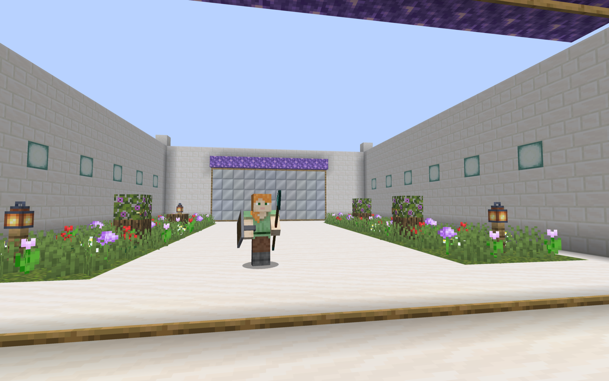
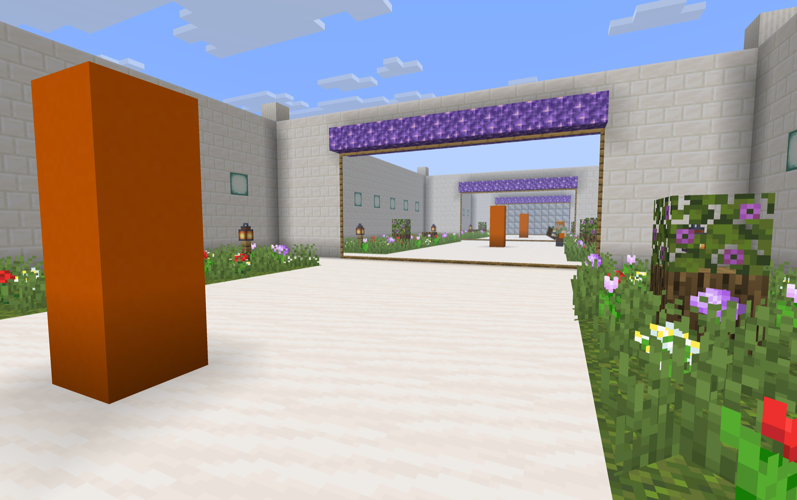

# Mirror

Reflective mirror blocks for Minecraft 26.1 and 26.2 (Fabric). Mirrors show a live planar reflection of the world around them, rendered natively on the client with no Immersive Portals or other rendering dependency.

## Screenshots





## Features

- A wood-framed mirror block that shows a live reflection of the world, correct from any viewing angle.
- You, other entities, and the item in your hand all appear in the reflection.
- Place mirrors next to each other and they merge into one larger mirror, with the frame opening up between connected cells.
- Mirror in a mirror: a mirror seen inside a reflection shows its own reflection (one bounce by default).
- Correct occlusion. Blocks, entities, walls, and the held item in front of a mirror hide the part of the reflection behind them.
- Reflections render out to your render distance, with a distance fog you can tune.
- Optional in-game settings through Mod Menu: how many reflections render at once, recursion depth, reflection distance, and fog.

## Crafting

Shaped recipe: sticks in the corners, glass on the sides, an amethyst shard in the middle.

```
stick  glass  stick
glass  shard  glass
stick  glass  stick
```

Place the mirror on a wall and look at it. Mirrors face the direction you place them.

## Requirements

- Minecraft 26.1.x or 26.2
- Fabric Loader (0.18.4 or newer for 26.1, 0.19 or newer for 26.2)
- Fabric API
- Java 25

For the in-game settings screen you also need Mod Menu and Cloth Config. The mod runs fine without them; you just lose the config UI and fall back to the config file.

In multiplayer the mod must be installed on both the server and the clients: the server provides the block, each client renders the reflection.

## Versions and branches

- `main` targets Minecraft 26.2.
- `mc-26.1` targets Minecraft 26.1.

Each branch builds and runs against its own Minecraft version. Releases are published per version (for example `0.1.0+26.2`).

## Build and run

Requires JDK 25 (for example `brew install openjdk@25`).

```bash
export JAVA_HOME=/opt/homebrew/opt/openjdk@25/libexec/openjdk.jdk/Contents/Home

./gradlew build        # builds build/libs/mirror-<version>.jar
./gradlew runClient    # launches a dev client
```

A demo world is included. In game, run `/function mirror:demo` to build a plaza of labelled mirror stations, or `/function mirror:stress` for a dense scene to gauge performance.

## Settings

Open the settings from Mod Menu (the wrench icon on the Mirror entry), or edit `config/mirror.json` directly. Changes apply immediately.

- Max reflections on screen: how many mirror planes render per frame, nearest first.
- Recursion depth: 1 turns off mirror in a mirror, 2 allows one bounce.
- Nested reflections per mirror: how many mirrors reflected inside a reflection get their own bounce.
- Max world re-renders per frame: an upper bound on total reflection passes.
- Reflection distance (chunks): how far reflections show. 0 follows your render distance.
- Fog start (blocks): the distance at which the reflection begins fading to fog.

Reflections re-render the world, so they cost GPU time. If frames are tight, lower the reflection distance, the max reflections, or the max re-renders.

## How it works

Each frame the mod finds the mirror blocks loaded around you. For the nearest few that are on screen, it renders the world from a camera reflected across each mirror plane into an offscreen buffer, then composites that buffer onto the mirror surface by projective texturing, so the reflection stays correct from any viewing angle. The composite is depth-tested against the scene so closer geometry occludes it.

## License

MIT. See [LICENSE](LICENSE).
